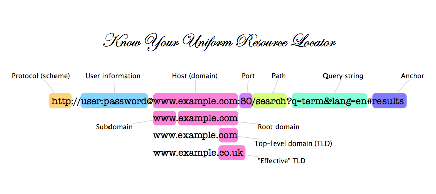

# Hands-on Flask-03-04: If-For structure, Handling Routes and Get-Post Methods
### Uygulamalı Flask-03-04: If-For yapısı, Rotaların İşlenmesi ve Get-Post Yöntemleri
Purpose of the this hands-on training is to give the students introductory knowledge of how to handle forms.
### Bu uygulamalı eğitimin amacı, öğrencilere formların nasıl işleneceği konusunda giriş seviyesinde bilgi vermektir.


## Learning Outcomes
### Öğrenme Çıktıları
At the end of the this hands-on training, students will be able to;
### Bu uygulamalı eğitimin sonunda öğrenciler şunları yapabileceklerdir;
- build a simple web application with Flask framework.
### - Flask framework ile basit bir web uygulaması oluşturun.
- understand the HTTP request-response cycle and structure of URL.
### - HTTP istek-yanıt döngüsünü ve URL'nin yapısını anlayabilir.
- create routes (or views) with Flask.
### - Flask ile rotalar (veya görünümler) oluşturun.
- serve static content and files using Flask.
### - Flask kullanarak statik içerik ve dosyalar sunun.
- serve dynamic content using the html templates.
### html şablonlarını kullanarak dinamik içerik sunun.
- write html templates using Jinja Templating Engine.
###  Jinja Templating Engine kullanarak html şablonları yazabilir.
- build a web application with Python Flask framework.
###  Python Flask framework ile bir web uygulaması oluşturmak.
- create if conditions and for loops with flask.
### flask ile if koşulları ve for döngüleri oluşturun.
- handle forms and GET-POST methods using the flask.
###  flask kullanarak formları ve GET-POST yöntemlerini işleyin.
- use git repo to manage the application versioning.
### - uygulama sürümünü yönetmek için git repo'sunu kullanın.

## Outline

- Part 1 - Getting to know routing and HTTP URLs.
### Bölüm 1 - Yönlendirme ve HTTP URL'lerini tanıma.
- Part 2 - Getting to know HTTP methods (GET & POST).
###  Bölüm 2 - HTTP yöntemlerini tanıma (GET & POST).
- Part 3 - Write a Web Application using If conditions and for loops
### Bölüm 3 - Eğer koşullarını ve for döngülerini kullanarak bir Web Uygulaması Yazın
- Part 4 - Write a Web Application with Sample Routings and Templating on GitHub Repo
###  Bölüm 4 - GitHub Repo'da Örnek Yönlendirmeler ve Şablonlama ile Web Uygulaması Yazma
- Part 5 - Learn to use GET and POST HTTP Method
###  Bölüm 5 - GET ve POST HTTP Yöntemini kullanmayı öğrenin
- Part 6 - Write a Sample Web Application with forms
### - Bölüm 6 - Formlarla Örnek Bir Web Uygulaması Yazın
## Part 1 - Getting to know routing and HTTP URLs.
### Bölüm 1 - Yönlendirme ve HTTP URL'lerini tanıma.
HTTP (Hypertext Transfer Protocol) is a request-response protocol. A client on one side (web browser) asks or requests something from a server and the server on the other side sends a response to that client. When we open our browser and write down the URL (Uniform Resource Locator), we are requesting a resource from a server and the URL is the address of that resource. The structure of typical URL is as the following.
### HTTP (Hypertext Transfer Protocol) bir istek-yanıt protokolüdür. Bir taraftaki istemci (web tarayıcısı) bir sunucudan bir şey ister veya talep eder ve diğer taraftaki sunucu bu istemciye bir yanıt gönderir. Tarayıcımızı açtığımızda ve URL'yi (Uniform Resource Locator) yazdığımızda, bir sunucudan bir kaynak talep etmiş oluruz ve URL bu kaynağın adresidir. Tipik bir URL'nin yapısı aşağıdaki gibidir.



The server responds to that request with an HTTP response message. Within the response, a status code element is a 3-digit integer defines the category of response as shown below.
### Sunucu bu isteğe bir HTTP yanıt mesajı ile yanıt verir. Yanıt içinde, aşağıda gösterildiği gibi yanıt kategorisini tanımlayan 3 basamaklı bir tamsayı olan bir durum kodu öğesi bulunur.


- 1xx -> Informational ---> It means the request was received and the process is continuing.
###  1xx -> Bilgilendirici ---> Talebin alındığı ve sürecin devam ettiği anlamına gelir.
- 2xx -> Success ---> It means the action was successfully received, understood, and accepted.
### 2xx -> Başarılı ---> Eylemin başarıyla alındığı, anlaşıldığı ve kabul edildiği anlamına gelir.
- 3xx -> Redirection ---> It means further action must be taken in order to complete the request.
### - 3xx -> Yeniden Yönlendirme ---> Talebin tamamlanması için daha fazla işlem yapılması gerektiği anlamına gelir.
- 4xx -> Client Error ---> It means the request contains incorrect syntax or cannot be fulfilled.
### - 4xx -> İstemci Hatası ---> İsteğin yanlış sözdizimi içerdiği veya yerine getirilemediği anlamına gelir.
- 5xx -> Server Error ---> It means the server failed to fulfill an apparently valid request.
### - 5xx -> Sunucu Hatası ---> Sunucunun görünüşte geçerli bir isteği yerine getiremediği anlamına gelir.
If you would learn those codes one by one. I can sent you a URL. You can also find different resources. 
### Eğer bu kodları tek tek öğrenirseniz. Sana bir URL gönderebilirim. Farklı kaynaklar da bulabilirsiniz.
https://www.w3schools.com/tags/ref_httpmessages.asp

## Part 2 - Getting to know HTTP methods (GET & POST)
###  Bölüm 2 - HTTP yöntemlerini tanıma (GET ve POST)
HTTP (Hypertext Transfer Protocol) is a request-response protocol. A client on one side (web browser) asks or requests something from a server and the server on the other side sends a response to that client. 
### HTTP (Hypertext Transfer Protocol) bir istek-yanıt protokolüdür. Bir taraftaki istemci (web tarayıcısı) bir sunucudan bir şey ister veya talep eder ve diğer taraftaki sunucu bu istemciye bir yanıt gönderir.
When sending request, the client can send data with using different http methods like `GET, POST, PUT, HEAD, DELETE, PATCH, OPTIONS`, but the most common ones are `GET` and `POST`.
### İstek gönderirken, istemci `GET, POST, PUT, HEAD, DELETE, PATCH, OPTIONS` gibi farklı http yöntemlerini kullanarak veri gönderebilir, ancak en yaygın olanları `GET` ve `POST`tur.


- HTTP `GET` method request;
### HTTP `GET` yöntemi isteği;
    
    - used to request data from a specified resource.
###  belirtilen bir kaynaktan veri istemek için kullanılır.
    - can be cached.
###  önbelleğe alınabilir.
    - remains in the browser history.
### - tarayıcı geçmişinde kalır.
    - can be bookmarked
###  yer imlerine eklenebilir
    - should never be used when dealing with sensitive data.
### hassas verilerle uğraşırken asla kullanılmamalıdır.
    - has length limitation.
###  uzunluk sınırlaması vardır.
    - only used to request data, not to modify it. 
### sadece veri talep etmek için kullanılır, değiştirmek için değil.
- HTTP `POST` method request;
    ### - HTTP `POST` yöntemi isteği;
    - never cached.
### asla önbelleğe alınmaz.
    - does not remain in the browser history.
### tarayıcı geçmişinde kalmaz.
    - can not be bookmarked
###  yer imlerine eklenemez
    - can be used when dealing with sensitive data.
### hassas verilerle uğraşırken kullanılabilir.
    - has no length limitation.
###  uzunluk sınırlaması yoktur.
## Part 3 - Write a Web Application using If conditions and for loops

- Copy `flask-03-handling-routes-and-if-for` within `my-repository` repo
###  my-repository` reposu içindeki `flask-03-handling-routes-and-if-for` dosyasını kopyalayın
- Under `Flask_If_for_structure` folder within `flask-03-handling-routes-and-if-for` repo
###  flask-03-handling-routes-and-if-for` reposu içindeki `Flask_If_for_structure` klasörü altında
- Create python file named `app.py`
### App.py` adında python dosyası oluşturun
```python
# Import Flask modules --- Flask modüllerini içe aktarma
# Create an object named app --- app adında bir nesne oluşturun

# Create a function named head which shows the massage as "This is my first conditions experience" in `index.html` 
--### Masajı `index.html` içinde "Bu benim ilk koşul deneyimim" şeklinde gösteren head adında bir işlev oluşturun.
# and assign to the route of ('/') --- ve ('/') rotasına atayın

# Create a function named header which prints numbers elements of list one by one in `index.html` 
|| ###  header adında bir fonksiyon oluşturun, bu fonksiyon `index.html`de listenin sayı elemanlarını tek tek yazdırır.
# and assign to the route of ('/')
--###  ve ('/') rotasına atayın
# run this app in debug mode on your local.
-- ### # bu uygulamayı yerel bilgisayarınızda hata ayıklama modunda çalıştırın.
```

## Part 4 - Write a Web Application with Sample Routings and Templating on GitHub Repo
###  Bölüm 4 - GitHub Repo'da Örnek Yönlendirmeler ve Şablonlama ile Web Uygulaması Yazma

- Let's head over `flask-03-handling-routes` folder within `flask-03-handling-routes-and-if-for` repo
### - Şimdi `flask-03-handling-routes-and-if-for` reposu içindeki `flask-03-handling-routes` klasörüne gidelim
- Create python file named `app.py`
### App.py` adında python dosyası oluşturun
```python
#Import Flask modules *** Flask modüllerini içe aktarma

#Create an object named app ### App adında bir nesne oluşturun


# Create a function named home which returns a string 'This is home page for no path, <h1> Welcome Home</h1>' 
### 'Bu, hiçbir yol için ana sayfadır, <h1> Eve Hoş Geldiniz</h1>' dizesini döndüren home adında bir işlev oluşturun
# and assign route of no path ('/')
### ve yol yok ('/') rotasını atayın

# Create a function named about which returns a formatted string '<h1>This is my about page </h1>' 
# and assign to the static route of ('about')


# Create a function named error which returns a formatted string '<h1>Either you encountered an error or you are not authorized.</h1>' 
# and assign to the static route of ('error')


# Create a function named admin which redirect the request to the error path 
# and assign to the route of ('/admin')


# Create a function named greet which return formatted inline html string 
# and assign to the dynamic route of ('/<name>')


# Create a function named greet_admin which redirect the request to the hello path with param of 'Master Admin!!!!' 
# and assign to the route of ('/greet-admin')


# Rewrite a function named greet which uses template file named `greet.html` under `templates` folder 
# and assign to the dynamic route of ('/<name>'). 
# Please find a template html file named `greet.html` which takes `name` as parameter under `templates` folder 


# Create a function named list10 which creates a list counting from 1 to 10 within `list10.html` 
# and assign to the route of ('/list10'). 
# Please find a template html file named `list10.html` which shows a list counting from 1 to 10 under `templates` folder 


# Create a function named evens which show the even numbers from 1 to 10 within `evens.html` 
# and assign to the route of ('/evens'). 
# Please find a template html file named `evens.html` which shows a list of even numbers from 1 to 10 under `templates` folder 


# Add a statement to run the Flask application which can be reached from any host on port 80.
```

## Part 5 - Learn to use GET and POST HTTP Method

- Go to `Flask_GET_POST_Methods` folder under the `flask-04-handling-forms-POST-GET-Methods` folder

- Create file named `app.py`  here. 

```python
# Import Flask modules


# Create an object named app


# create a function named "lcm" which calculates a least common multiple values of two numbers. 


# Create a function named `index` which uses template file named `index.html` 
# send two numbers as template variable to the app.py and assign route of no path ('/') 


# calculate sum of them using "lcm" function, then sent the result to the 
# "result.hmtl" file and assign route of path ('/calc'). 
# When the user comes directly "/calc" path, "Since this is a GET request, LCM has not been calculated" string returns to them with "result.html" file


# Add a statement to run the Flask application which can be debugged.

```

## Part 6 - Write a Sample Web Application with forms

- Go to `flask-04-handling-forms` within `flask-04-handling-forms-POST-GET-Methods` folder

- Now, we'll write an application with form handling and save the complete code as `app-form-handling.py` under `flask-04-handling-forms` folder.

```python
# Import Flask modules


# Create an object named app


# Write a function named `greet` which uses template file named `greet.html` given under 
# `templates` folder. it takes parameters from query string on URL, assign that parameter 
# to the 'user' variable and sent that user name into the html file. If it doesn't have any parameter, warning massage is raised


# Write a function named `greet` which uses template file named `greet.html` given under `templates` folder


# Write a function named `login` which uses `GET` and `POST` methods, 
# and template files named `login.html` and `secure.html` given under `templates` folder 
# and assign to the static route of ('login')


# Add a statement to run the Flask application which can be reached from any host on port 80.


# app.run(host='0.0.0.0', port=80)
```

